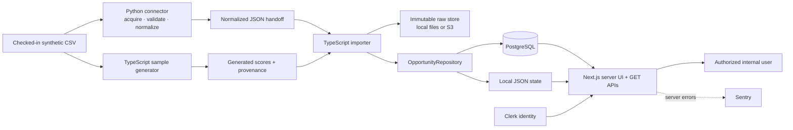
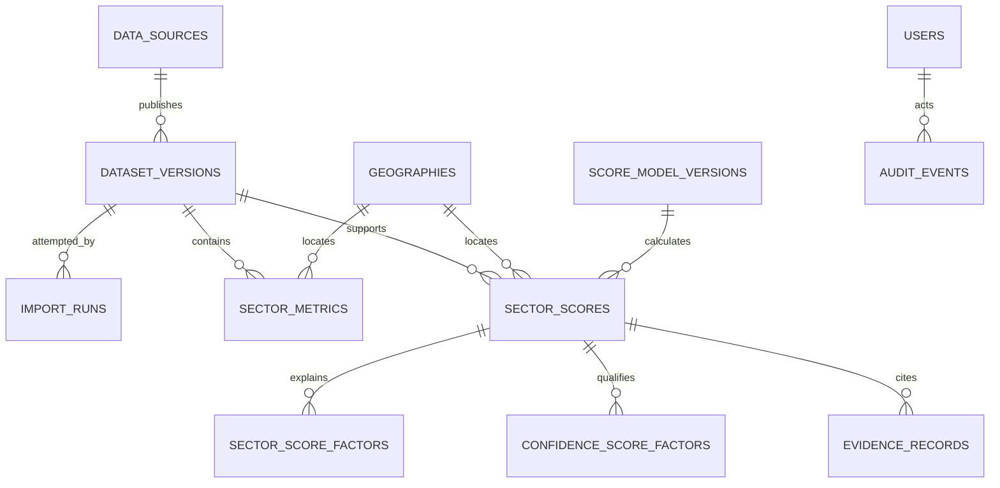

# Neora Business Opportunity Index architecture

The system is a production-oriented vertical slice for ranking sector opportunities in Bogotá, Medellín, and Cali. It deliberately proves a small, auditable path—synthetic aggregate input to authorized evidence-backed UI—before adding companies, outreach, orchestration, or multi-country scale.

## Architecture at a glance



The governing decision is [ADR 0001: modular monolith](docs/decisions/0001-modular-monolith.md). One web/API deployable, versioned TypeScript packages, and a separate Python workspace keep boundaries explicit without creating distributed-system overhead.

## Product target versus current slice

The product target is specified under [docs/pilot](docs/pilot/README.md): internal prioritization at `Bogotá × CIIU division × reference period`, using official open evidence and a three-expert approval gate. The current architecture remains a synthetic, three-city vertical slice. It proves technical boundaries but does not yet implement the official CIIU universe, evidence-type classification, expert-validation persistence, or the five-state publication lifecycle.

Treat the pilot documents as requirements for future interfaces, not as current runtime claims. In particular, the present `sectorCode` aliases are not official CIIU division codes, and the current `scored` state means numerical coverage passed rather than expert-approved publication.

## System context

| Actor or system | Relationship | Trust boundary |
|---|---|---|
| Internal analyst/partner | Reviews city/sector rankings, confidence, factors, and evidence | Must have a database-backed application role |
| Operator | Runs imports and inspects import status | `run_import` permission; execution remains outside the web app |
| Clerk | Authenticates production users | Supplies user ID only; does not grant application roles |
| PostgreSQL | Production system of record for roles, lineage, scores, and audit data | Authoritative application state |
| S3-compatible storage | Holds immutable raw assets | Private bucket, checksum-addressed keys |
| Vercel | Hosts the Next.js web/API application in `gru1` | Does not host the Python pipeline |
| GitHub Actions/local operator | Runs verification and, when chosen, ingestion | No remote scheduler is implemented in the app |

## Containers and components

### Web/API container — `apps/web`

- Next.js 16 App Router renders the Market Explorer on the server and hydrates the interactive ranking UI.
- `requestIdentity` chooses explicit non-production demo identity, a non-production test identity, or Clerk session identity.
- API routes expose read-only market, sector, import-status, and synthetic evidence-manifest endpoints.
- Runtime persistence is selected once per server process: local file adapter for explicit demo mode, otherwise PostgreSQL.
- Shared repository output is parsed through `sectorScoreSchema` before reaching presentation code.

### Domain packages

| Package | Owns | Must not own |
|---|---|---|
| `@neora/scoring` | Model definitions, coverage rules, weighted calculations, confidence labels | I/O, identity, persistence, UI |
| `@neora/contracts` | Runtime-validated score wire shape and connector interfaces | Database queries or scoring policy |
| `@neora/db` | Repository abstraction, adapters, schema, migrations, role/permission policy, raw-store adapters | UI rendering or Python normalization |
| `@neora/ui` | Reusable React presentation primitives | data access or authorization |

### Data workspace — `pipelines`

The Python 3.12 connector follows `discover → acquire → validate_raw → normalize → load`. Polars reads and normalizes; Pandera validates the raw aggregate shape; PyArrow is available for columnar interchange; boto3 supports S3 integration. The current connector handles one checked-in synthetic Colombia fixture and writes an atomic JSON handoff.

Python stops at normalized facts. It does not calculate product scores. This boundary keeps market ranking logic versioned, testable, and shared by generation/import code in TypeScript.

## End-to-end data flow

1. **Discover:** the connector identifies the synthetic 2025 Colombia dataset.
2. **Acquire:** bytes are copied into a SHA-256-addressed raw path.
3. **Validate:** required columns, factor ranges, nullability, and the expected 15-row pilot shape are checked.
4. **Normalize:** city aliases and sector codes are mapped; factor values remain in `[0, 1]` or `null`.
5. **Generate:** `scripts/generate-sample.ts` independently reads the fixture, calculates opportunity and confidence, attaches evidence IDs, and writes the checked-in generated JSON artifact.
6. **Join at import:** `scripts/import-sample.ts` rejects the handoff if its checksum differs from the generated artifact.
7. **Store raw:** the original CSV is written immutably to local storage or `raw/sha256/<checksum>/<filename>` in S3.
8. **Persist transactionally:** source, dataset version, import run, models, metrics, scores, factors, evidence, and audit event are persisted through `OpportunityRepository`.
9. **Read with policy:** server code resolves identity, checks permission, applies license/research-mode filtering, validates the returned contract, and renders the UI or JSON response.
10. **Trace evidence:** factor IDs link to evidence records whose source URI points to an authorized static provenance manifest, not a raw filesystem path.

### Idempotency and replay

Dataset identity is `(source_id, checksum_sha256)`. Replaying identical content:

- reuses the dataset version;
- does not insert metrics, scores, factors, evidence, or audit data again;
- records a new import run with status `duplicate`;
- tolerates a retried import-run UUID by generating a new opaque UUID in PostgreSQL.

This is dataset idempotency, not “the whole command does nothing.” Import history intentionally records each attempt.

## Runtime boundaries

| Mode | Selection | State | Identity | Visibility |
|---|---|---|---|---|
| Local demo | non-production and `NEORA_LOCAL_DEMO=true` | `data/runtime/neora-demo.json` plus local raw directory | fixed administrator demo identity | approved data plus synthetic research data |
| Production | every other case | PostgreSQL plus S3-compatible storage | Clerk ID resolved through `users` | approved sources only |
| Integration | explicit test environment | Testcontainers PostgreSQL and LocalStack | seeded non-production Clerk ID | exercises production adapters and filters |
| E2E | Playwright web server | isolated `data/e2e-runtime` | explicit demo identity | deterministic synthetic sample |

Local-file persistence implements the repository contract for development, but it is not intended for concurrent production writers.

## Data model



| Entity | Purpose and identity |
|---|---|
| `data_sources` | Publisher, country, license review, outreach flag, and synthetic marker |
| `dataset_versions` | Immutable content version; unique by source and checksum |
| `import_runs` | Operational history for completed, failed, running, or duplicate attempts |
| `geographies` | Country/city identity by official code |
| `score_model_versions` | Named model kind/version, weights, coverage threshold, activation state |
| `sector_metrics` | Normalized factor inputs for one dataset, geography, sector, and period |
| `sector_scores` | Result plus complete JSON payload and links to both model versions and dataset |
| factor tables | Per-factor values, weights, contributions, evidence URIs, and observation timestamps |
| `evidence_records` | Human-readable evidence provenance and license status |
| `users` | Clerk user ID to authoritative application role mapping |
| `audit_events` | Actor/action/entity metadata for persisted import activity |

The local JSON adapter mirrors the same conceptual aggregate rather than recreating relational joins.

## Scoring and provenance

### Opportunity model v1

The seven weights total 100: digital gap 20, automation potential 20, economic capacity 15, accessible market 15, competitive pressure 10, service fit 10, and accessibility 10. Minimum available weight is 65%.

For non-null factors, the model renormalizes over available weight:

```text
coverage = available factor weight / total model weight × 100
score    = Σ(value × weight) / available factor weight × 100
```

When coverage is below the model threshold, status is `insufficient_data`, score and all contributions are `null`, and missing inputs remain `null`.

### Confidence model v1

Confidence is a separate 100%-coverage model: authority/traceability 30, completeness 25, freshness 20, cross-source consistency 15, and entity resolution 10. Labels are high at 80+, medium at 60+, low at 40+, otherwise insufficient.

### Provenance chain

```text
raw bytes → SHA-256 → raw URI → dataset version → normalized metrics
          → model versions → factor contributions → score payload
          → evidence IDs/source manifest → UI
```

The generated artifact includes its input path, checksum, synthetic flag, scores, model versions, factor evidence IDs, and source metadata. The importer requires checksum agreement between Python and TypeScript outputs. Production raw storage adds the checksum as object metadata and uses conditional creation.

## Security and authorization

### Authentication and role resolution

1. In production, Clerk returns a user ID.
2. The repository looks up that ID in `users`.
3. No row means no application identity and access is denied.
4. The application checks permissions before repository reads.

| Role | `view_markets` | `run_import` | `activate_model` | `review_company` |
|---|---:|---:|---:|---:|
| Administrator | Yes | Yes | Yes | Yes |
| Analyst | Yes | Yes | No | Yes |
| Commercial partner | Yes | No | No | Yes |
| Technical partner | Yes | No | No | Yes |

The current product implements market viewing and import-status viewing. Model activation and company review are policy vocabulary for later slices, not current endpoints.

### Data controls

- Market reads require `view_markets`; import history requires `run_import`.
- The synthetic evidence endpoint also requires `view_markets` and accepts one fixed dataset name.
- License filtering occurs in repository queries. Local demo explicitly enables research visibility for synthetic data; production does not.
- Local demo and test identity shortcuts are guarded by `NODE_ENV !== "production"`.
- Secrets are supplied through environment configuration and ignored by Git.
- Raw buckets are expected to have versioning, encryption, and public access blocking, but infrastructure policy is not provisioned or enforced by this repository.

### Known security gaps

- Role seeding is manual SQL; there is no administrative provisioning workflow.
- Authorization is application-level. Database row-level security is not implemented.
- The repository does not include infrastructure-as-code, secret rotation, retention policy, backup policy, WAF/rate-limit policy, or a formal threat model.
- Sentry configuration must be reviewed for production data-scrubbing requirements before real evidence is ingested.

## Deployment and operations

### Web

`vercel.json` deploys the Next.js application from the monorepo, pins functions to `gru1`, installs with the frozen pnpm lockfile, and builds `@neora/web`. The intended production data services are PostgreSQL (documented as Neon in `sa-east-1`) and private versioned S3 storage in `sa-east-1`.

Those cloud resources are external prerequisites: this repository does not provision them. Regional placement and cross-border/data-residency requirements must be reassessed before real customer or official-source data is introduced.

### Ingestion

Imports are operator- or CI-triggered. The web API reports import status but does not enqueue or execute jobs. Revisit this boundary when execution duration, cadence, retry policy, or concurrency warrants a scheduler/worker architecture.

### Observability

- Sentry server initialization is conditional on `SENTRY_DSN`, with environment derived from Vercel or Node and a 10% trace sample rate.
- Import runs retain code version, counts, errors, status, and timestamps.
- Audit events capture actor, action, entity, metadata, and occurrence time.
- CI is the main operational proof: typecheck, lint, unit, PostgreSQL/LocalStack integration, build, Playwright, and Python tests.

Not yet present: structured application logging, metrics, dashboards, alert thresholds, uptime checks, job telemetry, trace propagation through imports, and documented incident response.

## Failure behavior

| Failure | Current behavior |
|---|---|
| Missing demo flag and `DATABASE_URL` | Runtime creation throws immediately |
| Missing production raw bucket during import | Import exits with an explicit error |
| Python quality failure | Pipeline exits before normalization/load |
| Python/TypeScript checksum mismatch | Import aborts before persistence |
| Unknown or unauthorized user | Page denies access; APIs return 403 |
| Unapproved production source | Repository omits its market scores |
| Insufficient opportunity evidence | Returns `insufficient_data` with null score/contributions |
| Duplicate content | Records duplicate import run; reuses persisted dataset |
| Unavailable Docker | Integration suite fails its prerequisite check; it does not skip |

## Verification architecture

- **Unit:** pure scoring, authorization, contract consumers, local persistence, import policy, normalization, and raw-storage behavior.
- **Integration:** real SQL migrations and transactions against PostgreSQL plus immutable S3 behavior against LocalStack; also exercises Python-to-TypeScript import and production-style web reads.
- **E2E:** isolated local persistence, seeded sample import, Next.js server, browser ranking, filters, evidence navigation, and GET APIs.
- **Build-time consistency:** the root build regenerates the sample artifact before package builds.

The tests prove adapters and boundaries, not the accuracy of synthetic business values.

## Decisions, risks, and evolution triggers

| Area | Current decision | Risk or trigger to revisit |
|---|---|---|
| Deployment shape | Modular monolith | Split only when job duration, independent scaling, or release cadence demands it |
| Scoring | Deterministic TypeScript package | New model semantics require a new version and migration/activation plan |
| Ingestion | Manual/CI Python pipeline | Add orchestration for schedules, durable retries, concurrency, or long-running jobs |
| Persistence | Repository interface with local and PostgreSQL adapters | Local adapter cannot provide production concurrency/transaction guarantees |
| Raw storage | SHA-256 content addressing | Define lifecycle/retention/legal hold before real datasets |
| Authorization | Clerk identity plus database roles | Add provisioning, revocation SLA, audit review, and possibly RLS before wider access |
| Geography | Three Colombian pilot cities | Contracts, aliases, official codes, and compliance need redesign before expansion |
| Evidence | Synthetic static manifest | Real sources need licensing, redaction, availability, and link-rot policy |
| Observability | Sentry plus persisted import/audit records | Add service objectives, metrics, alerting, and runbooks before production operations |

## Product and governance documentation

The Bogotá pilot now has a cohesive requirements set:

- [Product requirements](docs/pilot/product-requirements.md)
- [Data dictionary and source catalog](docs/pilot/data-dictionary-and-source-catalog.md)
- [Scoring model card](docs/pilot/scoring-model-card.md)
- [Expert validation protocol](docs/pilot/expert-validation.md)
- [Governance and operations](docs/pilot/governance-and-operations.md)

The documents intentionally leave source identities, licenses, exact indicator transformations, named owners, and operating cadences pending until verified. Remaining pre-production documentation includes a formal threat model, production deployment/backup runbook, external API compatibility contract if consumers are added, service objectives/alerting, retention/deletion policy, and the organization-level security incident process.
